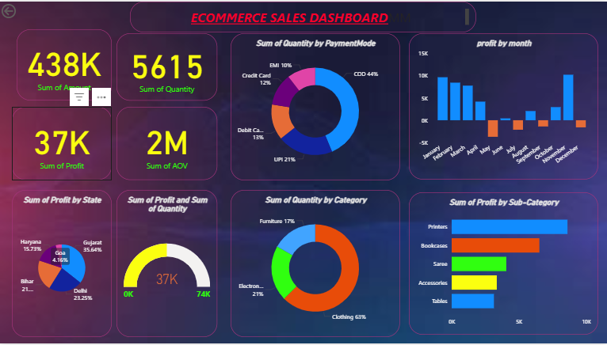

# 🛒 E-Commerce Sales Dashboard (Power BI)

This repository contains an **interactive Power BI dashboard** built to analyze **E-Commerce sales data**. The dashboard provides deep insights into sales performance, customer behavior, and profitability using data visualization techniques.

---

## 📊 Dashboard Preview

<p align="center">
  
</p>

---

## 📁 Project Files

### 🔹 Data Files

#### 📄 details.csv
Contains product-level information such as:
- Category  
- Sub-category  
- Profit  
- Quantity  

#### 📄 orders.csv
Contains order-level data including:
- Order ID  
- Order Date  
- Customer details  
- Sales amount  

---

### 🔹 Excel File

#### 📊 ECOMMERCE SALES REPORT.xlsx
- Contains metadata extracted from Power BI  
- Helps understand:
  - Column structure  
  - Data model relationships  
  - Expressions used in the report  

---

### 🔹 Report Files

- 📑 `SALES DASHBOARD.pdf` → Static report view  
- 📊 `SALES DASHBOARD.pbip / .pbix` → Interactive Power BI dashboard  
- 🖼️ `doshboard.png` → Dashboard preview image  

---

## 📈 Key KPIs (From Dashboard)

- 💰 **Total Sales Amount:** 438K  
- 📦 **Total Quantity Sold:** 5615  
- 📈 **Total Profit:** 37K  
- 🧾 **Average Order Value (AOV):** 2M  

---

## 🔍 KPI Explanation

### 💰 Total Sales Amount
- Sum of all sales transactions  
- Helps measure overall revenue performance  

### 📦 Total Quantity
- Total number of products sold  
- Indicates demand level  

### 📈 Total Profit
- Difference between revenue and cost  
- Shows business profitability  

### 🧾 Average Order Value (AOV)
- Average revenue per order  
- Helps understand customer spending behavior  

---

## 📊 Charts & Visualizations Used

### 📅 1. Profit by Month (Bar Chart)
- Displays monthly profit trends  
- Helps identify:
  - Seasonal patterns  
  - Profit fluctuations  

---

### 💳 2. Quantity by Payment Mode (Donut Chart)
- Shows distribution of payment methods  

**Insights:**
- COD (44%) is the most used method  
- Followed by UPI, Debit Card, Credit Card, EMI  

---

### 🛍️ 3. Quantity by Category (Donut Chart)
- Displays product category contribution  

**Insight:**
- Clothing (63%) dominates sales  

---

### 🗺️ 4. Profit by State (Pie Chart)
- Shows geographical profit distribution  

**Insight:**
- Gujarat (~35%) is the top-performing state  

---

### 📦 5. Profit by Sub-Category (Bar Chart)
- Displays profit generated by sub-categories  

**Insight:**
- Printers and Bookcases generate highest profit  

---

### 🎯 6. Profit & Quantity Gauge
- Shows performance against a target range  

**Example:**
- Current value: **37K profit**  
- Target range: up to **74K**  

---

## 🛠️ Tools & Technologies Used

### 🔹 Power BI
- Data visualization  
- Dashboard creation  
- Interactive filtering (slicers)  
- Report publishing  

---

### 🔹 CSV Files
- Used as raw data source  
- Easy to import into Power BI  
- Structured format for analysis  

---

### 🔹 Microsoft Excel
- Metadata extraction  
- Understanding data structure  
- Supporting analysis  

---

### 🔹 DAX (Data Analysis Expressions)

#### ✅ Purpose:
- Create KPIs  
- Perform aggregations  
- Build calculated columns  

#### ✅ Common Functions:
- `SUM()` → Total sales, profit  
- `COUNT()` → Number of orders  
- `AVERAGE()` → AOV calculation  

#### ✅ Example:
```DAX
Total Sales = SUM(Orders[Amount])

Total Profit = SUM(Details[Profit])

AOV = AVERAGE(Orders[Amount])
```

#### ✅ Why DAX is Important:
- Enables dynamic calculations  
- Works with filters and slicers  
- Helps create interactive dashboards  

---

## 🚀 Steps to Build This Dashboard

1. **Data Collection**
   - Imported `orders.csv` and `details.csv`  

2. **Data Cleaning**
   - Checked missing values  
   - Verified data types  

3. **Data Modeling**
   - Created relationships between tables  

4. **DAX Calculations**
   - Created KPIs like Sales, Profit, AOV  

5. **Visualization**
   - Built charts (bar, pie, donut, gauge)  

6. **Dashboard Design**
   - Organized visuals for better storytelling  

---

## 🎯 Key Insights

- Clothing category contributes the most sales  
- COD is the most preferred payment method  
- Gujarat generates highest profit  
- Seasonal profit fluctuations observed  
- Printers and Bookcases are top profit generators  

---

## 🤝 Contributing

Feel free to fork this repository and improve the dashboard or analysis.

---

## 📬 Contact

For any queries or suggestions, feel free to reach out!
